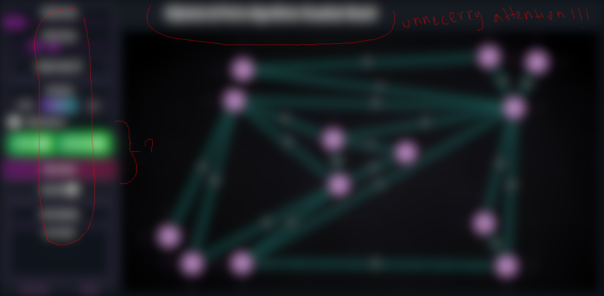
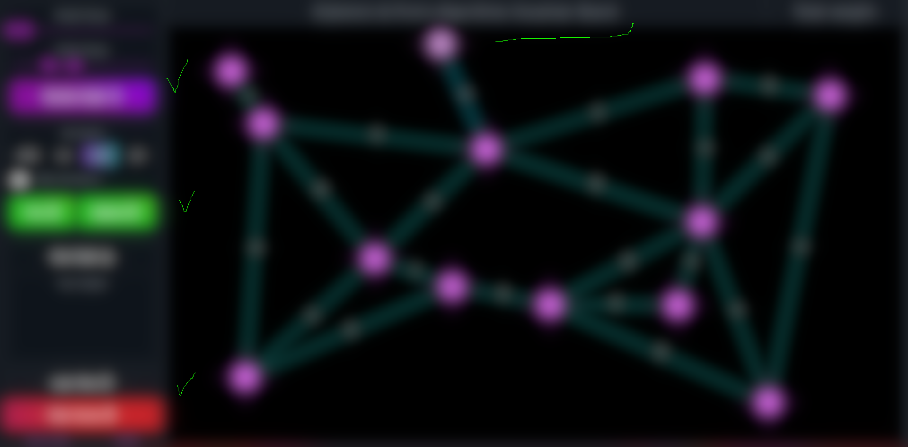

# Dijkstra's & Prim's Algorithms Visualizer


Dijkstra's & Prim's Algorithms Visualizer is a client-side web application that allows users to create and customize graphs as well as run Dijkstra's and Prim's algorithms on those graphs. Users can control speed of execution, number of nodes, and weihgt range for a given graph, and if the user wishes he can save the graph locally on his computer.

The project was built using React, if you would like to contribute to the project, leave me a message at **adilet.developer@gmail.com**.

## UPDATE 3/6/2024

User Interface has changed to remove elements that unnecessarily catch attention, and to better define the action buttons.

PREVIOUS:


CURRENT:


## Instructions

1. Clone the git repo
2. Download the recommended extensions (going to pop up from the right-bottom side of the screen).
3. Install nvm (Node Version Manager) on your machine. Here is the link to the article on how to do it [FreeCodeCamp](https://www.freecodecamp.org/news/node-version-manager-nvm-install-guide/).
4. Install node and npm (Node Package Manager) by running

```
nvm install node latest
```

4. Check if everything is okay (run commands)

```
nvm --version
node --version
npm --version
```

5. Now install all the dependencies

```
cd dijkstra-prim-visualization
npm install
```

6. To run the app locally

```
npm run dev
```

## Important information

- Project configured with Prettier Code Formatter and ESlint linter, so every time you are going to save a file it is going to format itself (done to preserve one style of coding among all files). That's why you also had to install recommended extensions.
- Vite bundler is used instead of Webpack due to better developer-experience.
